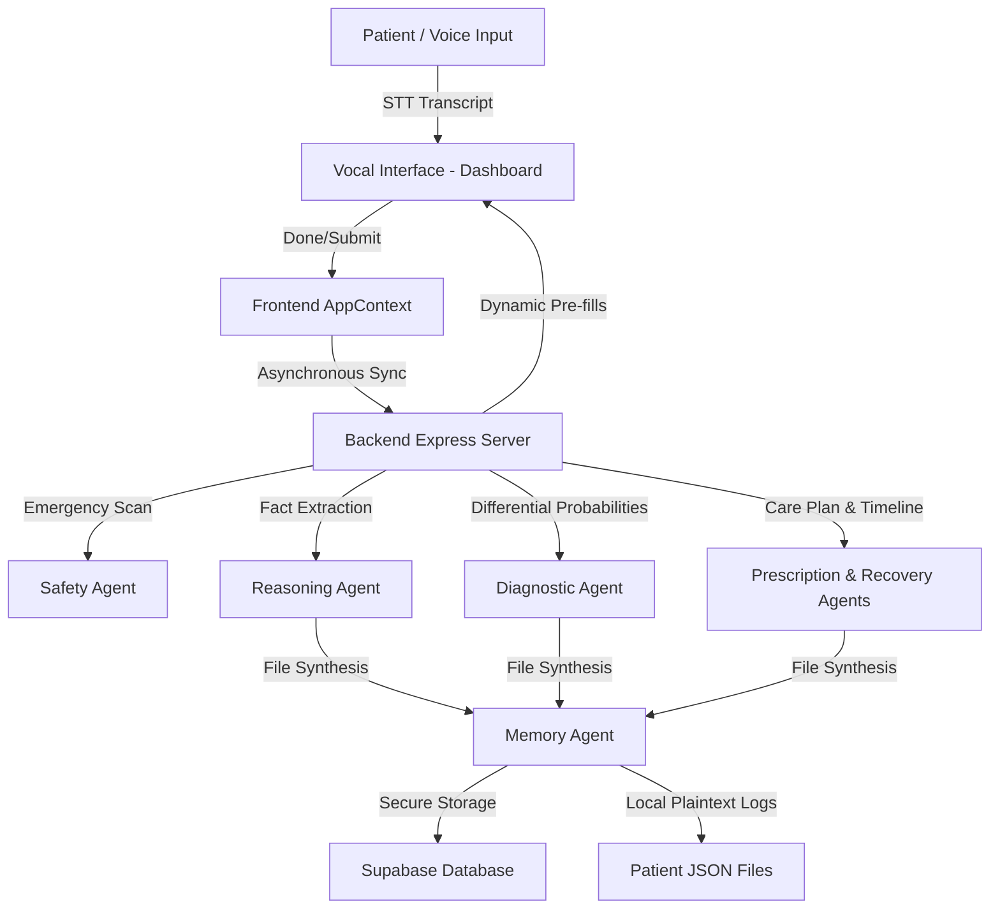

# Smart GOV Health (SGH-Cure)

Smart GOV Health (SGH-Cure) is a premium, zero-latency digital healthcare portal designed for government clinics and public hospitals. By combining high-fidelity Web Speech (STT/TTS) interaction, client-side progressive caching, and a rotated multi-agent Gemini AI orchestrator, SGH-Cure automates patient clinical intake, diagnostic triage routing, and prescription/roadmap preparation.

---

## 🚀 Key Features

*   🎙️ **Zero-Latency Vocal Interface**: Trilingual intake interaction (English, Hindi, Kannada) powered by Web SpeechRecognition with real-time transcript rebuilding, de-duplication, and instant driver unmounting (`.abort()`) for lag-free redo actions.
*   🧠 **Dynamic Clinical Intake**: Backend-guided adaptive intake flow. The system automatically decides context-appropriate questions (6 to 10 max) based on the patient's primary complaint, bypassing redundant clinical queries.
*   🤖 **Rotated Multi-Agent Orchestrator**: Runs an asynchronous pipeline of Gemini-powered clinical specialists:
    *   **Reasoning Agent**: Extracts patient facts, biometric details, and symptoms.
    *   **Diagnostic Agent**: Calculates differential diagnoses and maps patients to 12 distinct clinical departments.
    *   **Prescription & Recovery Agents**: Formulates customized care plans, OTC remedies, and day-by-day recovery roadmaps.
*   🛡️ **Refined Safety Scan**: Runs clinical emergency audits to catch life-critical complaints (e.g., severe chest pain) immediately. Unlike standard triage flows, emergency diagnostics are fully preserved to allow seamless appointment booking.
*   🪪 **Digital Health Card & QR Hub**: Mobile-wrapped, print-friendly clinical health records featuring QR codes, dynamic BMI indexing, and biometrics.
*   📅 **cancellation Slot Control**: Integrated appointment cancellation directly inside the Dashboard History list.

---

## 🛠️ Tech Stack

*   **Frontend**: React (Vite), Tailwind CSS, Framer Motion, Capacitor.js (Android SDK 35, Gradle 8.14).
*   **Backend**: Node.js, Express, Nodemon, Native Rotated Gemini API Handler.
*   **Database**: Supabase client integration with RLS policy partitioning and runtime offline memory fallbacks.

---

## 📐 System Architecture



---

## ⚙️ Setup & Execution

### 1. Prerequisite Configuration
Create a `.env` file in the root folder with the following properties:
```env
SUPABASE_URL=your_supabase_project_url
SUPABASE_KEY=your_supabase_anon_key
VITE_GEMINI_KEY_1=your_gemini_api_key_1
VITE_GEMINI_KEY_2=your_gemini_api_key_2
VITE_BYPASS_LLM=false
```

### 2. Launch Backend Server
```bash
cd backend
npm install
npm run dev
```
*The orchestrator server will boot on* `http://localhost:5000`.

### 3. Launch Frontend Web App
```bash
cd frontend
npm install
npm run dev
```
*Open* `http://localhost:5173` *in your browser to interact with the interface.*

---

## 📱 Mobile APK Compilation (Capacitor)

Compile a production-ready package to test SGH-Cure on physical Android phones:

1.  **Configure Backend Tunnel**:
    Run `npx ngrok http 5000` to get your public HTTPS URL (e.g. `https://your-session.ngrok-free.dev`) and replace `API_BASE_URL` in `frontend/src/config.js`.
2.  **Build Frontend Web Bundle**:
    ```bash
    cd frontend
    npm run build
    npx cap sync
    ```
3.  **Compile Android APK**:
    Specify your Java 21 JDK path and assemble Gradle (using compile SDK version 35):
    ```powershell
    $env:JAVA_HOME = "C:\Program Files\Android\Android Studio\jbr"
    cd android
    .\gradlew.bat clean assembleDebug
    ```
    *The generated package is located at:* `C:\sgh-build\app\outputs\apk\debug\app-debug.apk`